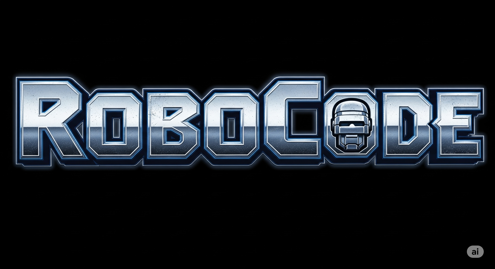

Initial credits to [Christian Robertson](https://fonts.google.com/?query=Christian%20Robertson), [Roboto Mono](https://fonts.google.com/specimen/Roboto+Mono)'s designer.

## Patch

``` bash
docker run --rm --volume "$(pwd)/release":/in --volume "$(pwd)/nerd":/out --env "PN=1" nerdfonts/patcher --complete
```

La `|` no me gusta, creo que debe ser más gruesa (al menos en Windows Terminal se ve más fina que la `l`).
